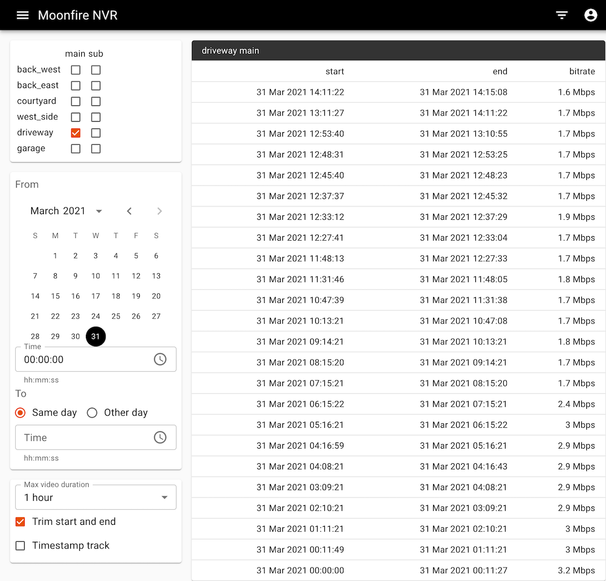
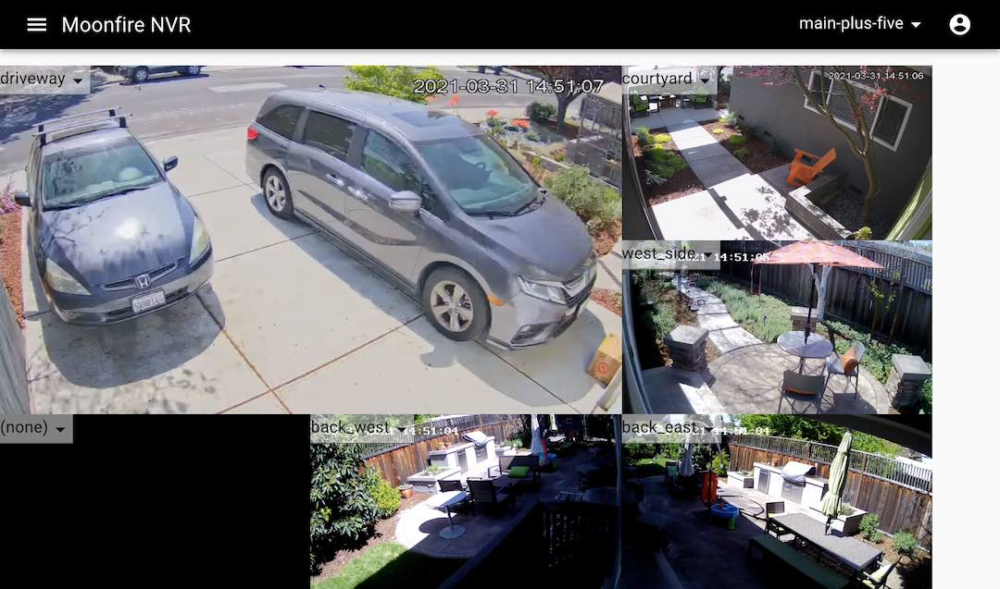

* [Introduction](#introduction)
* [Documentation](#documentation)

# Introduction

Moonfire NVR is an open-source security camera network video recorder, started
by Scott Lamb &lt;<slamb@slamb.org>&gt;. It saves H.264-over-RTSP streams from
IP cameras to disk into a hybrid format: video frames in a directory on
spinning disk, other data in a SQLite3 database on flash. It can construct
`.mp4` files for arbitrary time ranges on-the-fly. It does not decode,
analyze, or re-encode video frames, so it requires little CPU. It handles six
1080p/30fps streams on a [Raspberry Pi
2](https://www.raspberrypi.org/products/raspberry-pi-2-model-b/), using
less than 10% of the machine's total CPU.

**Help wanted to make it great! Please see the [contributing
guide](CONTRIBUTING.md).**

So far, the web interface is basic: a filterable list of video segments,
with support for trimming them to arbitrary time ranges. No scrub bar yet.
There's also an experimental live view UI.

<table>
  <tbody>
    <tr valign=top>
      <td></td>
      <td></td>
    </tr>
  </tbody>
</table>

There's no support yet for motion detection, no https/TLS support (you'll
need a proxy server, as described [here](guide/secure.md)), and only a
console-based (rather than web-based) configuration UI.

Moonfire NVR is currently at version 0.6.3. Until version 1.0, there will be no
compatibility guarantees: configuration and storage formats may change from
version to version. There is an [upgrade procedure](guide/schema.md) but it is
not for the faint of heart.

I hope to add features such as video analytics. In time, we can build
a full-featured hobbyist-oriented multi-camera NVR that requires nothing but
a cheap machine with a big hard drive. There are many exciting techniques we
could use to make this possible:

*   avoiding CPU-intensive H.264 encoding in favor of simply continuing to use
    the camera's already-encoded video streams. Cheap IP cameras these days
    provide pre-encoded H.264 streams in both "main" (full-sized) and "sub"
    (lower resolution, compression quality, and/or frame rate) varieties. The
    "sub" stream is more suitable for fast computer vision work as well as
    remote/mobile streaming. Disk space these days is quite cheap (with 4 TB
    drives costing about $100), so we can afford to keep many camera-months
    of both streams on disk.
*   off-loading on-NVR analytics to an inexpensive USB or M.2 neural network
    accelerator and hardware H.264 decoders.
*   taking advantage of on-camera analytics. They're often not as accurate, but
    they're the best way to stretch very inexpensive NVR machines.

# Documentation

*   [Contributing](CONTRIBUTING.md)
*   [License](LICENSE.txt) —
    [GPL-3.0-or-later](https://spdx.org/licenses/GPL-3.0-or-later.html)
    with [GPL-3.0-linking-exception](https://spdx.org/licenses/GPL-3.0-linking-exception.html)
    for OpenSSL.
*   [Change log](CHANGELOG.md) / release notes.
*   [Guides](guide/)
    *   [Installing](guide/install.md)
    *   [Building from source](guide/build.md)
    *   [UI Development](guide/developing-ui.md)
    *   [Troubleshooting](guide/troubleshooting.md)
*   [Design documents](design/)
*   [Wiki](https://github.com/scottlamb/moonfire-nvr/wiki) has hardware
    recommendations, notes on several camera models, etc. Please add more!
