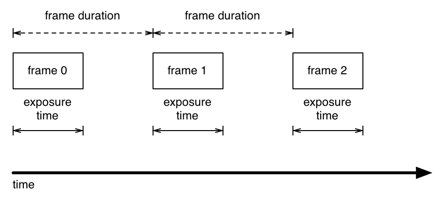

# Moonfire NVR Time Handling

Status: **draft**

> A man with a watch knows what time it is. A man with two watches is never
> sure.
>
> — Segal's law

## Objective

Maximize the likelihood Moonfire NVR's timestamps are useful.

The timestamp corresponding to a video frame should roughly match timestamps
from other sources:

   * another video stream from the same camera. Given a video frame from the
     "main" stream, a video frame from the "sub" stream with a similar
     timestamp should have been recorded near the same time, and vice versa.
     This minimizes confusion when switching between views of these streams,
     and when viewing the "main" stream timestamps corresponding to a motion
     event gathered from the less CPU-intensive "sub" stream.
   * on-camera motion events from the same camera. If the video frame reflects
     the motion event, its timestamp should be roughly within the event's
     timespan.
   * streams from other cameras. Recorded views from two cameras of the same
     event should have similar timestamps.
   * events noted by the owner of the system, neighbors, police, etc., for the
     purpose of determining chronology, to the extent those persons use
     accurate clocks.

Two segments of video recorded from the same stream of the same camera should
not overlap. This would make it impossible for a user interface to present a
simple timeline for accessing all recorded video.

Durations should be useful over short timescales:

   * If an object's motion is recorded, distance travelled divided by the
     duration of the frames over which this motion occurred should reflect the
     object's average speed.
   * Motion should appear smooth. There shouldn't be excessive frame-to-frame
     jitter due to such factors as differences in encoding time or network
     transmission.

This document describes an approach to achieving these goals when the
following statements are true:

   * the NVR's system clock is within a second of correct on startup. (True
     when NTP is functioning or when the system has a real-time clock battery
     to preserve a previous correct time.)
   * the NVR's system time does not experience forward or backward "step"
     corrections (as opposed to frequency correction) during operation.
   * the NVR's system time advances at roughly the correct frequency. (NTP
     achieves this through frequency correction when operating correctly.)
   * the cameras' clock frequencies are off by no more than 500 parts per
     million (roughly 43 seconds per day).
   * the cameras are geographically close to the NVR, so in most cases network
     transmission time is under 50 ms. (Occasional delays are to be expected,
     however.)
   * the cameras issue at least one RTCP sender report per recording.
   * the cameras are occasionally synchronized via NTP.

When one or more of those statements are false, the system should degrade
gracefully: preserve what properties it can, gather video anyway, and when
possible include sufficient metadata to assess trustworthiness.

Additionally, the system should not require manual configuration of camera
frequency corrections.

## Background

Time in a distributed system is notoriously tricky. [Falsehoods programmers
believe about
time](http://infiniteundo.com/post/25326999628/falsehoods-programmers-believe-about-time)
and [More falsehoods programmers believe about time; "wisdom of the crowd"
edition](http://infiniteundo.com/post/25509354022/more-falsehoods-programmers-believe-about-time)
give a taste of the problems encountered. These problems are found even in
datacenters with expensive, well-tested hardware and relatively reliable
network connections. Moonfire NVR is meant to run on an inexpensive
single-board computer and record video from budget, closed-source cameras,
so such problems are to be expected.

Moonfire NVR typically has access to the following sources of time
information:

   * the local `CLOCK_REALTIME`. Ideally this is maintained by `ntpd`:
     synchronized on startup, and frequency-corrected during operation. A
     hardware real-time clock and battery keep accurate time across restarts
     if the network is unavailable on startup. In the worst case, the system
     has no real-time clock or no battery and a network connection is
     unavailable. The time is far in the past on startup and is never
     corrected or is corrected via a step while Moonfire NVR is running.
   * the local `CLOCK_MONOTONIC`. This should be frequency-corrected by `ntpd`
     and guaranteed to never experience "steps", though its reference point is
     unspecified.
   * the local `ntpd`, which can be used to determine if the system is
     synchronized to NTP and quantify the precision of synchronization.
   * each camera's clock. The ONVIF specification mandates cameras must
     support synchronizing clocks via NTP, but in practice cameras appear to
     use SNTP clients which simply step time periodically and provide no
     interface to determine if the clock is currently synchronized. This
     document's author owns several cameras with clocks that run roughly 100
     ppm fast (9 seconds per day) and are adjusted via steps.
   * the RTP timestamps from each of a camera's streams. As described in [RFC
     3550 section 5.1](https://tools.ietf.org/html/rfc3550#section-5.1), these
     are monotonically increasing with an unspecified reference point. They
     can't be directly compared to other cameras or other streams from the
     same camera. Emperically, budget cameras don't appear to do any frequency
     correction on these timestamps.
   * in some cases, RTCP sender reports, as described in [RFC 3550 section
     6.4](https://tools.ietf.org/html/rfc3550#section-6.4). These correlate
     RTP timestamps with the camera's real time clock. However, these are only
     sent periodically, not necessarily at the beginning of the session.
     Some cameras omit them entirely depending on firmware version, as noted
     in [this forum post](http://www.cctvforum.com/viewtopic.php). Additionally,
     Moonfire NVR currently uses ffmpeg's libavformat for RTSP protocol
     handling; this library exposes these reports in a limited fashion.

The camera records video frames as in the diagram below:

Each frame has an associated RTP timestamp. It's unclear from skimming RFC
3550 exactly what time this represents, but it must be some time after the
last frame and before the next frame. At a typical rate of 30 frames per
second, this timespan is short enough that this uncertainty won't be the
largest source of time error in the system. We'll assume arbitrarily that the
timestamp refers to the start of exposure.

RTP doesn't transmit the duration of each video frame; it must be calculated
from the timestamp of the following frame. This means that if a stream is
terminated, the final frame has unknown duration.

As described in [schema.md](schema.md), Moonfire NVR saves RTSP video streams
into roughly one-minute "recordings", with a fixed rotation offset after the
minute in the NVR's wall time.

## Overview

Moonfire NVR will use the RTP timestamps to calculate video frames' durations.
For the first segment of video, it will trust these completely. It will use
them and the NVR's wall clock time to establish the start time of the
recording. For following segments, it will slightly adjust durations to
compensate for difference between the frequencies of the camera and NVR
clock, trusting the latter to be accurate.

## Detailed design

On every frame of video, Moonfire NVR will get a timestamp from
`CLOCK_MONOTONIC`. On the first frame, it will additionally get a timestamp
from `CLOCK_REALTIME` and compute the difference. It uses these to compute a
monotonically increasing real time of receipt for every frame, called the
_local frame time_. Assuming the local clock is accurate, this time is an
upper bound on when the frame was generated. The difference is the sum of the
following items:

   * H.264 encoding
   * buffering on the camera (particularly when starting the stream—some
     cameras apparently send frames that were captured before the RTSP session
     was established)
   * network transmission time

These values may produce some jitter, so the local frame time is not directly
used to calculate frame durations. Instead, they are primarily taken from
differences in RTP timestamps from one frame to the next. During the first
segment of video, these RTP timestamp differences are used directly, without
correcting for incorrect camera frequency. At the design limit of 500 ppm
camera frequency error, and an upper bound of two minutes of recording for the
initial segment (explained below), this causes a maximum of 60 milliseconds of
error.

The _local start time_ of a segment is calculated when ending it. It's defined
as the minimum for all frames of the local frame time minus the duration of
all previous frames. If there are many frames, this means neither initial
buffering nor spikes of delay in H.264 encoding or network transmission cause
the local start time to become inaccurate. The least delayed frame wins.

The first segment either ends with the RTSP session (due to error/shutdown) or
on rotation. In the former case, there may not be many samples to use in
calculating the local start time; accuracy may suffer but the system degrades
gracefully. Rotation doesn't happen until the second time the rotation offset
is passed, so rotation happens after 1–2 minutes rather than 0–1 minutes to
maximize accuracy.

The _start time_ of the first segment is its local start time. The start time
of following segments is the end time of the previous segment.

The duration of following segments is adjusted to compensate for camera
frequency error, assuming the NVR clock's frequency is more trustworthy. This
is done as follows. The _local duration_ of segment _i_ is calculated as the
local start time of segment _i+1_ minus the local start time of segment _i_.
The _cumulative error_ as of segment _i_ is defined as the local duration of
all previous segments minus the duration of all previous segments. The
duration of segment _i_ should be adjusted by up to 500 ppm to eliminate
cumulative error. (For a one-minute segment, this is 0.3 ms, or 27 90kHz units.)
This correction should be spread out across the segment to minimize jitter.

Each segment's local start time is also stored in the database as a delta to
the segment's start time. These stored values aren't  for normal system
operation but may be handy in understanding and correcting errors.

## Caveats

There's no particular reason to believe this will produce perfectly matched
streams between cameras or even of main and sub streams within a camera.
If this is insufficient, there's an alternate calculation of start time that
could be used in some circumstances: the _camera start time_. The first RTCP
sender report could be used to correlate a RTP timestamp with the camera's
wall clock, and thus calculate the camera's time as of the first frame.

The _start time_ of the first segment could be either its local start time or
its camera start time, determined via the following rules:

   1. if there is no camera start time (due to the lack of a RTCP sender
      report), the local start time wins by default.
   2. if the camera start time is before 2016-01-01 00:00:00 UTC, the local
      start time wins.
   3. if the local start time is before 2016-01-01 00:00:00 UTC, the camera
      start time wins.
   4. if the times differ by more than 5 seconds, the local start time wins.
   5. otherwise, the camera start time wins.

These rules are a compromise. When a system starts up without NTP or a clock
battery, it typically reverts to a time in the distant past. Therefore times
before Moonfire NVR was written should be checked for and avoided. When both
systems have a believably recent timestamp, the local time is typically more
accurate, but the camera time allows a closer match between two streams of
the same camera.

This still doesn't completely solve the problem, and it's unclear it is even
better. When using camera start times, different cameras' streams may be
mismatched by up twice the 5-second threshold described above. This could even
happen for two streams within the same camera if a significant step happens
between their establishment. More frequent SNTP adjustments may help, so that
individual steps are less frequent. Or Moonfire NVR could attempt to address
this with more complexity: use sender reports of established RTSP sessions to
detect and compensate for these clock splits.

It's unclear if these additional mechanisms are desirable or worthwhile. The
simplest approach will be adopted initially and adapted as necessary.
