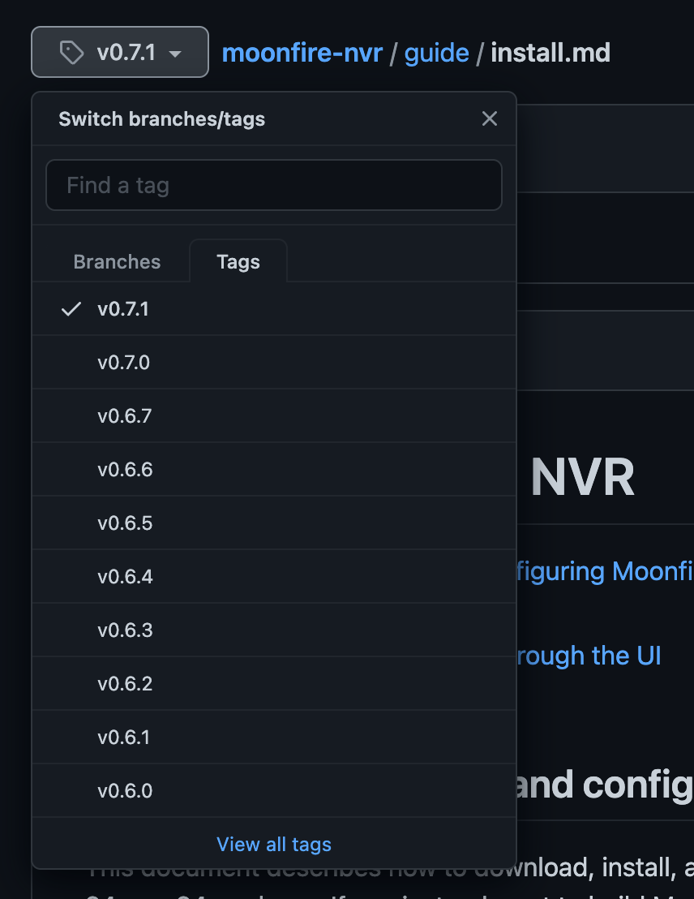

# Installing Moonfire NVR <!-- omit in toc -->

* [Downloading, installing, and configuring Moonfire NVR](#downloading-installing-and-configuring-moonfire-nvr)
    * [Dedicated hard drive setup](#dedicated-hard-drive-setup)
    * [Completing configuration through the UI](#completing-configuration-through-the-ui)
    * [Starting it up](#starting-it-up)

## Downloading, installing, and configuring Moonfire NVR

This document describes how to download, install, and configure Moonfire NVR
via the prebuilt Linux binaries available for x86-64, arm64, and arm. If you
instead want to build Moonfire NVR yourself, see the [Build
instructions](build.md).

<table><tr><td><details>
<summary>Go to the instructions for your exact Moonfire version</summary>

Make sure you are viewing instructions that match the release you intend
to install. When viewing this page on Github, look for a pull-down in the upper
left, and pick the [latest tagged version](https://github.com/scottlamb/moonfire-nvr/releases/latest):



</details></td></tr></table>


Download the binary for your platform from the matching GitHub release.
Install it as `/usr/local/bin/moonfire-nvr` and ensure it is executable, e.g.
for version `v0.7.27`:

```console
$ VERSION=v0.7.27
$ ARCH=$(uname -m)
$ curl -OL "https://github.com/scottlamb/moonfire-nvr/releases/download/$VERSION/moonfire-nvr-$VERSION-$ARCH"
$ sudo install -m 755 "moonfire-nvr-$VERSION-$ARCH" /usr/local/bin/moonfire-nvr
```

<table><tr><td><details>
<summary>Docker</summary>

The procedure above, in which Moonfire runs directly on the host, is strongly
recommended.

  * The single binary installed in `/usr/local/bin` has zero dependencies.
    It is statically linked and bundles the UI. It just works. There's no
    complex distribution-specific install procedures or danger of conflicting
    version requirements between Moonfire and other software. These are the same
    problems most people use Docker to solve.
  * Moonfire's recommended install method used to involve Docker. In our
    experience, complexity around Docker commands, filesystem/process namespace
    mappings, broken seccomp defaults that do not allow standard system calls
    like `clock_gettime`, etc. has been a major frustration for folks installing
    Moonfire. Now that we have the zero-dependencies binary, we recommend
    sidestepping all of this and have rewritten the docs accordingly.

…but, you may still prefer Docker for familiarity or other reasons. If so, you
can install the [`ghcr.io/scottlamb/moonfire-nvr`](https://github.com/scottlamb/moonfire-nvr/pkgs/container/moonfire-nvr) Docker images instead. We'll
assume you know your way around your preferred tools and can adapt the
instructions to the workflow you use with Docker.  You may find the following
Docker compose snippet useful:

```yaml
services:
  moonfire-nvr:
    # The `vX.Y.Z` images will work on any architecture (x86-64, arm, or
    # aarch64); just pick the correct version.
    image: ghcr.io/scottlamb/moonfire-nvr:v0.7.27
    command: run

    volumes:
      # Pass through `/var/lib/moonfire-nvr` from the host.
      - "/var/lib/moonfire-nvr:/var/lib/moonfire-nvr"

      # Pass through `/etc/moonfire-nvr.toml` from the host.
      # Be sure to create `/etc/moonfire-nvr.toml` first (see below).
      # Docker will "helpfully" create a directory by this name otherwise.
      - "/etc/moonfire-nvr.toml:/etc/moonfire-nvr.toml:ro"

      # Pass through `/var/tmp` from the host.
      # SQLite expects to be able to create temporary files in this dir, which
      # was not created in Moonfire's minimal Docker image prior to 0.7.26.
      # See: <https://www.sqlite.org/tempfiles.html>
      - "/var/tmp:/var/tmp"

      # Add additional mount lines here for each sample file directory
      # outside of /var/lib/moonfire-nvr, e.g.:
      # - "/media/nvr:/media/nvr"

      # The Docker image doesn't include the time zone database; you must mount
      # it from the host for Moonfire to support local time.
      - "/usr/share/zoneinfo:/usr/share/zoneinfo:ro"

    # Edit this to match your `moonfire-nvr` user.
    # Note that Docker will not honor names from the host here, even if
    # `/etc/passwd` is passed through.
    # - Be sure to run the `useradd` command below first.
    # - Then run `echo $(id -u moonfire-nvr):$(id -g moonfire-nvr)` to see
    #   what should be filled in here.
    user: UID:GID

    # Uncomment this if Moonfire fails with `clock_gettime failed` (likely on
    # older 32-bit hosts). <https://github.com/moby/moby/issues/40734>
    # security_opt:
    # - seccomp:unconfined

    environment:
      # Edit zone below to taste.
      TZ: "America/Los_Angeles"
      RUST_BACKTRACE: 1

    # docker's default log driver won't rotate logs properly, and will throw
    # away logs when you destroy and recreate the container. Using journald
    # solves these problems.
    # <https://docs.docker.com/config/containers/logging/configure/>
    logging:
      driver: journald
      options:
        tag: moonfire-nvr

    restart: unless-stopped

    ports:
    - "8080:8080/tcp"
```

Command reference:

<table>

<tr><th colspan="2">Initialize the database</th></tr>
<tr><th>Non-Docker</th><td><code>sudo -u moonfire-nvr moonfire-nvr init</code></td></tr>
<tr><th>Docker</th><td><code>sudo docker compose run --rm moonfire-nvr init</code></td></tr>

<tr><th colspan="2">Run interactive configuration</th></tr>
<tr><th>Non-Docker</th><td><code>sudo -u moonfire-nvr moonfire-nvr config 2>debug-log</code></td></tr>
<tr><th>Docker</th><td><code>sudo docker compose run --rm moonfire-nvr config 2>debug-log</code></td></tr>

<tr><th colspan="2">Enable and start the server</th></tr>
<tr><th>Non-Docker<td><code>sudo systemctl enable --now moonfire-nvr</code></td></tr>
<tr><th>Docker</th><td><code>sudo docker compose up --detach moonfire-nvr</code></td></tr>

</table>

</details></td></tr></table>

Next, you'll need to set up your filesystem and the Moonfire NVR user.

Moonfire NVR keeps two kinds of state:

*   a SQLite database, typically <1 GiB. It should be stored on flash if
    available. In most cases your root filesystem is on flash, so the
    default location of `/var/lib/moonfire-nvr/db` will be fine.
*   the "sample file directories", which hold the actual samples/frames of
    H.264 video. These should be quite large and are typically stored on hard
    drives. More below.

(See [schema.md](schema.md) for more information.)

On most Linux systems, you can create the user as follows:

```console
$ sudo useradd --user-group --create-home --home /var/lib/moonfire-nvr moonfire-nvr
```

Use your favorite editor to create `/etc/moonfire-nvr.toml`,
starting from the configurations below:

```console
$ sudo nano /etc/moonfire-nvr.toml
(see below for contents)
```

`/etc/moonfire-nvr.toml` (see [ref/config.md](../ref/config.md) for more explanation):
```toml
[[binds]]
ipv4 = "0.0.0.0:8080"
allowUnauthenticatedPermissions = { viewVideo = true }

[[binds]]
unix = "/var/lib/moonfire-nvr/sock"
ownUidIsPrivileged = true
```

Then initialize the database:

```console
$ sudo -u moonfire-nvr moonfire-nvr init
```

This will create a directory `/var/lib/moonfire-nvr/db` with a SQLite3 database
within it.

### Dedicated hard drive setup

If a dedicated hard drive is available, set it up now.

If you haven't yet created the filesystem, consider using
`mkfs.ext4 -T largefile -m 1`, as described in more detail [on the
wiki](https://github.com/scottlamb/moonfire-nvr/wiki/System-setup). If you're
using a USB SATA bridge, this is also a good time to ensure you're not
using UAS, as described there. UAS has been linked to filesystem corruption.

Set up the mount point and sample file directory:

```console
$ sudo blkid
(note the UUID of your new device)
$ sudo nano /etc/fstab
(see below for line to add)
$ sudo mkdir -p /media/nvr
$ sudo mount /media/nvr
$ sudo install -d -o moonfire-nvr -g moonfire-nvr -m 700 /media/nvr/sample
```

In `/etc/fstab`, add a line similar to this:

```
UUID=23d550bc-0e38-4825-acac-1cac8a7e091f    /media/nvr   ext4    nofail,noatime,lazytime,data=writeback,journal_async_commit  0       2
```

If you use the `nofail` attribute in `/etc/fstab` as described above, your
system will boot successfully even when the hard drive is unavailable (such as
when your external USB storage is unmounted). This can be helpful when
recovering from problems.

### Completing configuration through the UI

Once your system is set up, it's time to initialize an empty database
and add the cameras and sample directories. You can do this
by using the `moonfire-nvr` binary's text-based configuration tool.

```console
$ sudo -u moonfire-nvr moonfire-nvr config 2>debug-log
```

<table><tr><td><details>
<summary>Did it return without doing anything?</summary>

If `moonfire-nvr config` returns you to the console prompt right away, look in
the `debug-log` file for why. One common reason is that you have Moonfire NVR
running; you'll need to shut it down first. If you are running a systemd
service as described below, try `sudo systemctl stop moonfire-nvr` before
editing the config and `sudo systemctl start moonfire-nvr` after.
</details></td></tr></table>

In the user interface,

1.  add your sample file dir(s) under "Directories and retention".
    (Many streams can share a directory. It's recommended to have just one
    directory per hard drive.)

    If you used a dedicated hard drive, use the directory you precreated
    (eg `/media/nvr/sample`). Otherwise, try
    `/var/lib/moonfire-nvr/sample`. Moonfire NVR will create the directory as
    long as it has the required permissions on the parent directory.

2.  add cameras under "Cameras and streams".

    *   See the [wiki](https://github.com/scottlamb/moonfire-nvr/wiki) for notes
        about specific camera models. The [Configuring cameras](https://github.com/scottlamb/moonfire-nvr/wiki/Configuring-cameras)
        page mentions a couple tools that can autodetect RTSP URLs.

    *   There's a "Test" button to verify your settings directly from the add/edit
        camera dialog.

    *   Be sure to assign each stream you want to capture to a sample file
        directory and check the "record" box.

    *   `flush_if_sec` should typically be 120 seconds. This causes the database to
        be flushed when the first instant of one of this stream's completed
        recordings is 2 minutes old. A "recording" is a segment of a video
        stream that is 60–120 seconds when first establishing the stream,
        about 60 seconds midstream, and shorter when an error or server
        shutdown terminates the stream. Thus, a value just below 60 will
        cause the database to be flushed once per minute per stream in the
        steady state. A value around 180 will cause the database to be once
        every 3 minutes per stream, or less frequently if other streams cause
        flushes first. Lower values cause less video to be lost on power
        loss. Higher values reduce wear on the SSD holding the SQLite
        database, particularly when you have many cameras and when you record
        both the "main" and "sub" streams of each camera.

3.  Assign disk space to your cameras back in "Directories and retention".
    Leave a little slack between the total limit and the filesystem capacity,
    even if you store nothing else on the disk. 1 GiB of slack per camera should
    be plenty. This is needed for a few reasons:

    *   Up to `max(120, flush_if_sec)` seconds of video can be written before
        being counted toward the usage because the recording doesn't count until
        it's fully written, and old recordings can't be deleted until the
        next database flush. So a 8 Mbps video stream with `flush_if_sec=300`
        will take up to (8 Mbps * 300 sec / 8 bits/byte) = 300 MB ~= 286 MiB
        of extra disk space.
    *   If a file is open when it is deleted (such as if a HTTP client is
        downloading it), it stays around until the file is closed. Moonfire NVR
        currently doesn't account for this.
    *   Smaller factors: deletion isn't instantaneous, and directories
        themselves take up some disk space.

4.  Add a user for yourself (and optionally others) under "Users". You'll need
    this to access the web UI once you enable authentication.

### Starting it up

With this config, Moonfire NVR's web interface is **insecure**: it doesn't use
`https` and doesn't require you to authenticate to it. You might be comfortable
starting it in this configuration to try it out, particularly if the machine
it's running on is behind a home router's firewall. You might not; in that case
read through [secure the system](secure.md) first.

Assuming you want to proceed, you can launch Moonfire NVR through `systemd`.
Create `/etc/systemd/system/moonfire-nvr.service`:

```ini
[Unit]
Description=Moonfire NVR
After=network-online.target

# If you use an external hard drive, uncomment this with a reference to the
# mount point as written in `/etc/fstab`.
# RequiresMountsFor=/media/nvr

[Service]
ExecStart=/usr/local/bin/moonfire-nvr run
Environment=MOONFIRE_FORMAT=systemd
Environment=MOONFIRE_LOG=info
Environment=RUST_BACKTRACE=1
Type=notify
# large installations take a while to scan the sample file dirs
TimeoutStartSec=300
User=moonfire-nvr
Restart=on-failure
CPUAccounting=true
MemoryAccounting=true
BlockIOAccounting=true

[Install]
WantedBy=multi-user.target
```

Then start it up as follows:

```console
$ sudo systemctl daemon-reload              # read in the new config file
$ sudo systemctl enable --now moonfire-nvr  # start the service now and on boot
```

Some handy commands:

```console
$ sudo systemctl daemon-reload                                  # reload configuration files
$ sudo systemctl start moonfire-nvr                             # start the service now without enabling on boot
$ sudo systemctl stop moonfire-nvr                              # stop the service now (but don't wait for it finish stopping)
$ sudo systemctl status moonfire-nvr                            # show if the service is running and the last few log lines
$ sudo systemctl enable moonfire-nvr                            # start the service on boot
$ sudo systemctl disable moonfire-nvr                           # don't start the service on boot
$ sudo journalctl --unit=moonfire-nvr --since='-5 min' --follow # look at recent logs and await more
```

See the [systemd](http://www.freedesktop.org/wiki/Software/systemd/)
documentation for more information. The [manual
pages](http://www.freedesktop.org/software/systemd/man/) for `systemd.service`
and `systemctl` may be of particular interest.

The HTTP interface is accessible on port 8080; if your web browser is running
on the same machine, you can access it at
[http://localhost:8080/](http://localhost:8080/).

If the system isn't working, see the [Troubleshooting
guide](troubleshooting.md).

See also the [system setup guide](https://github.com/scottlamb/moonfire-nvr/wiki/System-setup)
on the wiki, which has additional advice on configuring a Linux system which
runs Moonfire NVR.

Once the web interface seems to be working, read through [securing Moonfire
NVR](secure.md).
