# Minimal Raspberry Pi 3 with Very Cheap Cameras

How to set-up moonfire-nvr using a Raspberry PI 3, separate hard drive for storage and very cheap IP Cameras.

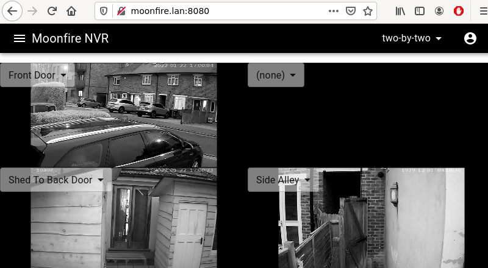
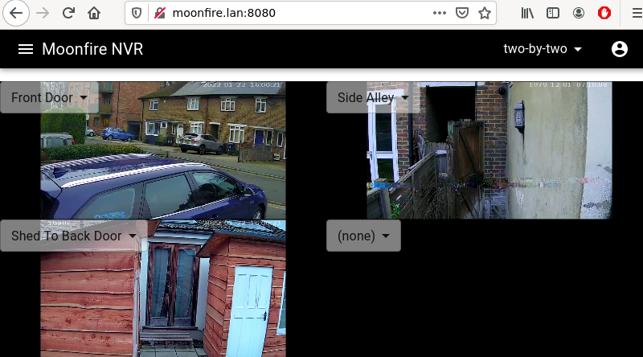

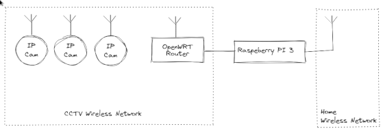

## Hardware

* Raspberry Pi 3 £25/$35
* PI Power Supply £5/$7
* Hard Drive 160GB £10/$14
* USB SATA Adapter £5/$7
* USB Extra power £2.5/$3.5

Base system £47.5/$65

* [OpenWRT Access Point](https://www.ebay.co.uk/sch/i.html?_from=R40&_nkw=homehub+openwrt&_sacat=0&LH_TitleDesc=0&LH_BIN=1&_sop=15) £20/$28
* [IP Cameras V380](https://www.ebay.co.uk/sch/i.html?_from=R40&_nkw=v380+camera&_sacat=0&_sop=15) £12.5/$17.5  x 3

I am using three cameras so total of £105/$143

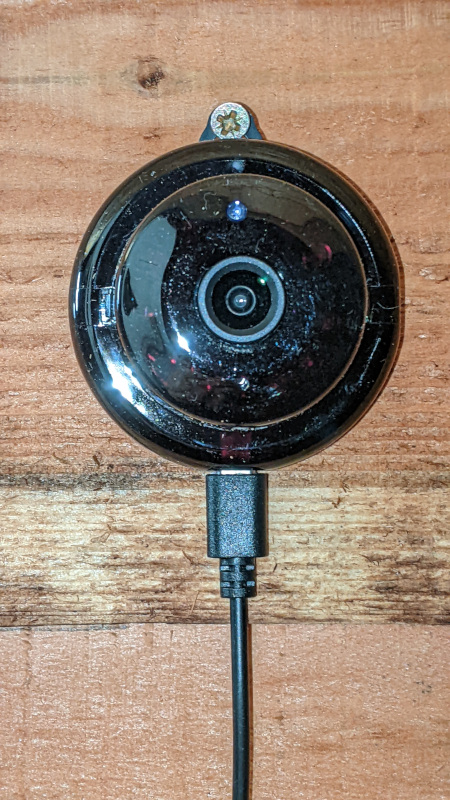

From my home wireless network I have a ngnix front-end so I can view Raspberry 3 from the internet. The CCTV wireless network is not conneced to the internet. The PI is Ethernet port is disconnected from the CCTV wireless network, until Set-up Moonfire so that routing to the internet is via my home wireless network.

Key to have additonal power to the SATA HD Adapter.

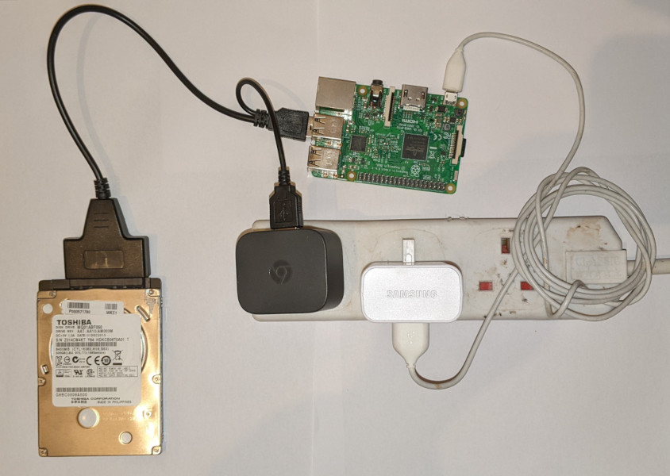

## IP Camera Set-up

Use the V380 App on a non-critial Android phone to set-up the CCTV wifi connection on the camera and insert a micro sd card to [enable the rtsp stream](https://ipcamtalk.com/threads/how-to-access-v380-video-feed-on-a-web-browser.35661/page-2#post-393069). Power cycle the IP Cameras and remove the V380 App. 

## Raspberry Pi 3 Set-up
### Headerless PI

Using rpi-imager, write Raspberry PI OS Lite (as port of Debian Bullseye) on to a microSD card

Mount the new boot partition and set wireless to home wifi network and enable ssh. 

	nano /media/mountpoint/boot/wpa_supplicant.conf 

Editing ssid and psk

	ctrl_interface=DIR=/var/run/wpa_supplicant GROUP=netdev
	update_config=1
	country=GB

	network={
	    ssid="YOURSSID"
	    psk="YOURPASSWORD"
	    scan_ssid=1
	}
    

Enable ssh 

	touch /media/mountpoint/boot/ssh

Umount the microSD card.  With the the Raspberry PI 3 disconnected from the OpenWRT router for the CCTV network, boot the Raspberry PI with the microSD card. 

### Configure PI

ssh in to the PI to run, password is raspberry

	ssh pi@raspberrypi.lan
	sudo raspi-config

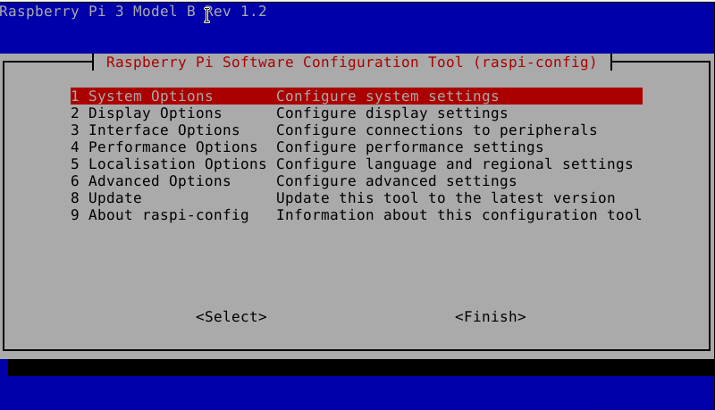

Select 1 System Options, S3 Password and choose new password. Then
Select 1 System Options, S4 Hostname and choose new password. I used moonfire
Then select finish and reboot

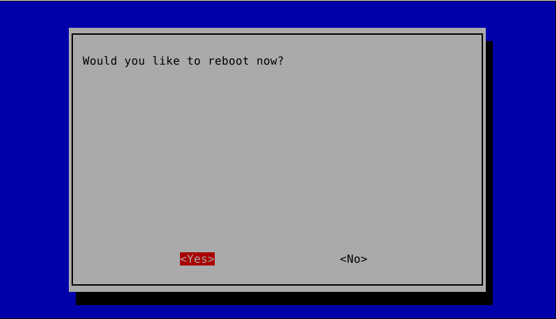

### Install Moonfire-nvr from source

#### Step 0 - Optional

Copy keys from your main Debian machine to the pi to make ssh easier.

	ssh-copy-id pi@moonfire.lan

#### Step 1 - Apt Packages 

Remotely connect:-

	ssh pi@moonfire.lan

Install all packages needed

	sudo apt-get update
	sudo apt-get -y install git \
               build-essential \
               libavcodec-dev \
               libavformat-dev \
               libavutil-dev \
               libncurses-dev \
               libsqlite3-dev \
               pkgconf \
               sqlite3 \
               tzdata \
               screen \
               lld \
               ffmpeg

The above list includes [screen](https://linuxize.com/post/how-to-use-linux-screen/) as some of the compile session take a while. Includes lld to avoid a memory error complying with cargo. Includes ffmpeg as the [IP cameras do not correctly implement rtsp](https://github.com/scottlamb/moonfire-nvr/issues/187). 

#### Step 2 - Node.js Packages

	curl -fsSL https://deb.nodesource.com/setup_16.x | sudo bash -
	sudo apt-get install -y nodejs

#### Step 3 - Rust Install

As per instructions at [rustup.rs](https://rustup.rs/)

	curl --proto '=https' --tlsv1.2 -sSf https://sh.rustup.rs | sh

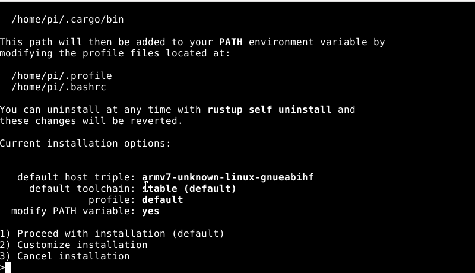

Proceed with the default installation 

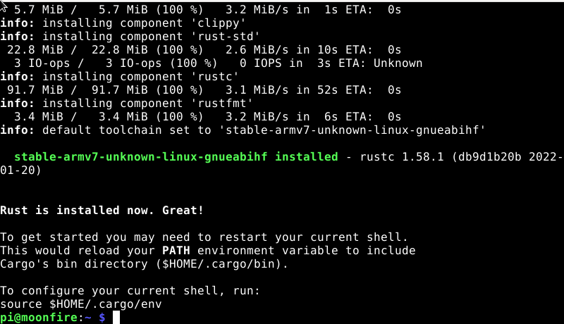

At this point I deviate from the rust instructions. As I want to use screen from the point onwards and by logging and and in and using screen the current shell is reloaded. 

	exit

#### Step 4 - Cloning and compiling 

New session

	ssh pi@moonfire.lan
	screen
	
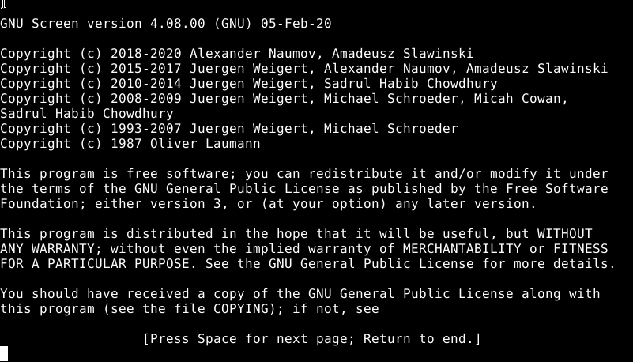

##### Step 4.1 moonfire-nvr binary 

	git clone https://github.com/scottlamb/moonfire-nvr.git
	cd moonfire-nvr/server/

Amend the linker that cargo uses to avoid memory issues 

	cat <<EOF >../.cargo/config
	[build]
	rustflags = "-C force-frame-pointers=yes -C link-arg=-fuse-ld=lld"
	EOF
	
	cargo test

This takes around 25 minutes. Then the next step.

	cargo build --release

This takes around 40 minutes. 

	sudo install -m 755 target/release/moonfire-nvr /usr/local/bin

##### Step 4.2 User Interface

	cd ~/moonfire-nvr/ui/
	npm install
	
This takes around 15 minutes. 

	export NODE_OPTIONS=--max_old_space_size=400
	npm run build
	sudo mkdir /usr/local/lib/moonfire-nvr
	sudo rsync --recursive --delete --chmod=D755,F644 ui/build/ /usr/local/lib/moonfire-nvr/ui

##### Step 4.3 Prepare var area
	sudo mkdir /var/lib/moonfire-nvr
	sudo chown $USER:$USER /var/lib/moonfire-nvr

##### Step 4.4 Prepare systemd

	cat <<EOF >/tmp/moonfire-nvr.service
	[Unit]
	Description=Moonfire NVR
	After=network-online.target
	RequiresMountsFor=/media/nvr 

	[Service]
	ExecStart=/usr/local/bin/moonfire-nvr run \
		--rtsp-library=ffmpeg \
	    --db-dir=/var/lib/moonfire-nvr/db \
	    --http-addr=0.0.0.0:8080 
	Environment=TZ=:/etc/localtime
	Environment=MOONFIRE_FORMAT=google-systemd
	Environment=MOONFIRE_LOG=error
	Environment=RUST_BACKTRACE=1
	Type=simple
	User=pi
	Nice=-20
	Restart=on-failure
	CPUAccounting=true
	MemoryAccounting=true
	BlockIOAccounting=true
	
	[Install]
	WantedBy=multi-user.target
	
	EOF
	sudo mv /tmp/moonfire-nvr.service /etc/systemd/system/moonfire-nvr.service

##### Step 4.4 Prepare filesystems

disable swap

	sudo dphys-swapfile swapoff
	sudo dphys-swapfile uninstall 
	pi@moonfire:~/moonfire-nvr $ sudo systemctl disable dphys-swapfile

###### Step 4.4.1 Optional Log2ram 
I had many problems with this, the log2ram filling up with logs. Not sure it vital and can be a pain to set-up. Tip once installed and if any problems with moonfire starting check:-

	df -h | grep log2ram

Put logs into RAM, via [log2ram](https://github.com/azlux/log2ram). Note that 40M is not enough for boot-up 

	echo "SystemMaxUse=40M" | sudo tee -a /etc/systemd/journald.conf
	echo "deb [signed-by=/usr/share/keyrings/azlux-archive-keyring.gpg] http://packages.azlux.fr/debian/ bullseye main" | sudo tee /etc/apt/sources.list.d/azlux.list
	sudo wget -O /usr/share/keyrings/azlux-archive-keyring.gpg  https://azlux.fr/repo.gpg
	sudo apt update
	sudo apt install log2ram

Change log2ram Size to 60M	

	sudo nano /etc/log2ram.conf

At this point we can reboot to enable log2ram and we no longer need the screen session. 

	sudo reboot
	ssh pi@moonfire.lan

###### Step 4.4.2 Non-optional 

At this point I physically disconnect the USB connected hard drive and re-connect the USB cable, the run. Please remember to keep the SATA adapter powered at all times to avoid disk corruption/ 

	dmesg  | tail -n 5

	sudo fdisk /dev/sda

Delete any partitions, then add one new partition, as per the screenshots below. This will obviously delete any data on the disk. 

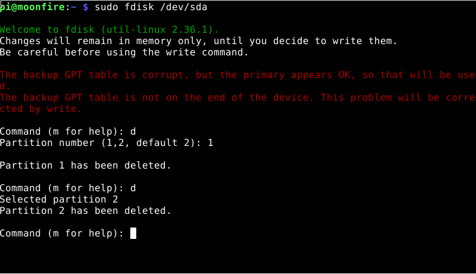
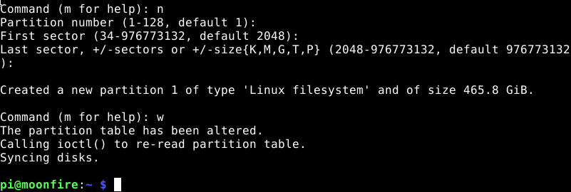

Create new filesystem

	sudo mkfs -t ext4 /dev/sda1

See note [disable-uas](https://github.com/scottlamb/moonfire-nvr/wiki/System-setup#disable-uas) but this was not an issue on my hardware

	sudo mkdir /media/nvr
	sudo mount /dev/sda1 /media/nvr
	
	sudo chown -R pi:pi /media/nvr
	
	# Set up areas for each camera
	mkdir /media/nvr/camera_01
	mkdir /media/nvr/camera_02
	mkdir /media/nvr/camera_03
	sudo umount /media/nvr 

Next obtain the UUID
 
	sudo blkid /dev/sda1
	

Replacing with the UUI obtained above 

	echo "UUID=_YOUR_UUID__    /media/nvr   ext4    nofail,noatime,lazytime,data=writeback,journal_async_commit  0       2" | sudo tee -a /etc/fstab

Note the mount point much match the line in Step 4.4 Prepare systemd, RequiresMountsFor

##### Step 4.5 Adjust Network to route via Wireless

	echo "interface eth0
	nogateway" | sudo tee -a /etc/dhcpcd.conf

##### Step 4.6 Reboot

	sudo reboot

### Set-up Moonfire

Connect the PI via the Ethernet port to OpenWRT Router to access the IP cameras via the CCTV wireless network. 

	ssh pi@moonfire.lan

	moonfire-nvr init
	moonfire-nvr config
	
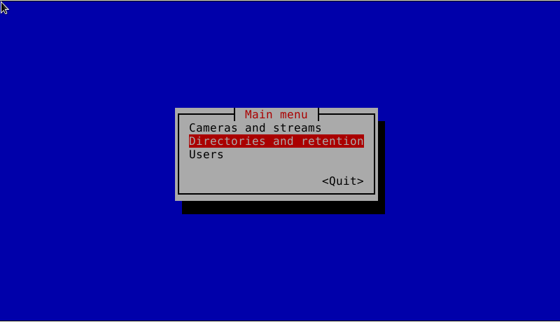

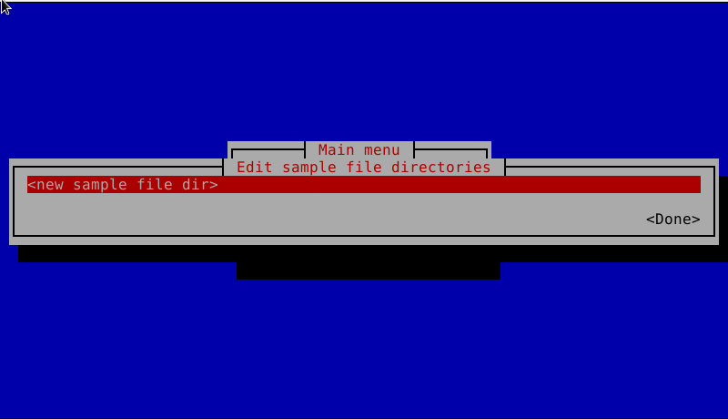

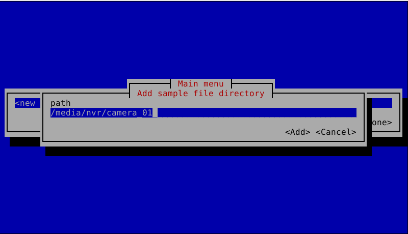

Repeat for /media/nvr/camera_02 and /media/nvr/camera_03

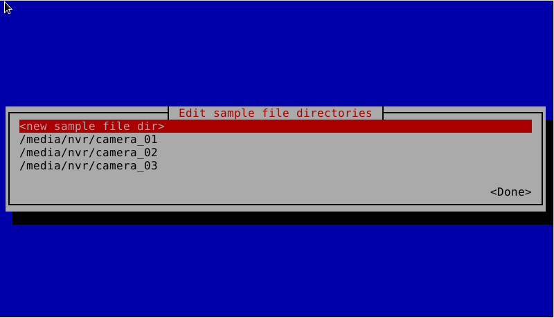

Then select Done and then select Cameras and Streams

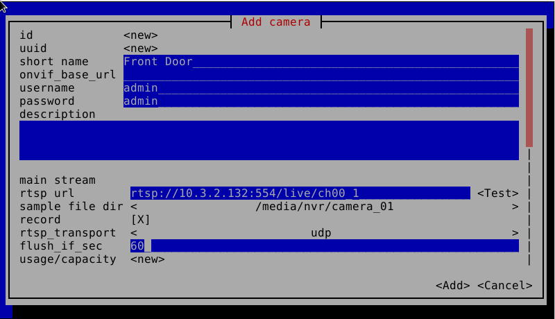

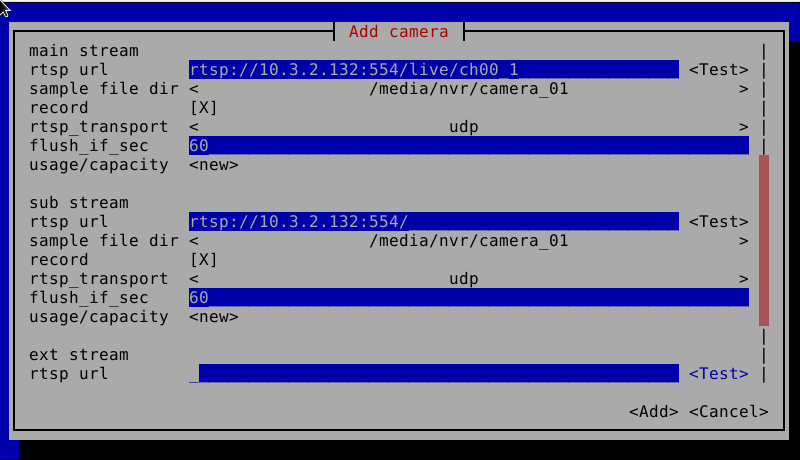
 
I carried on and added all three cameras

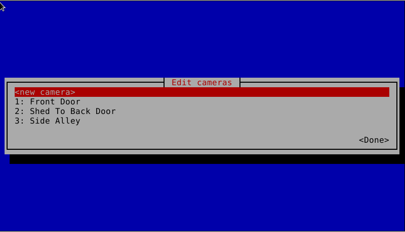
 
Then select Done and then select Users

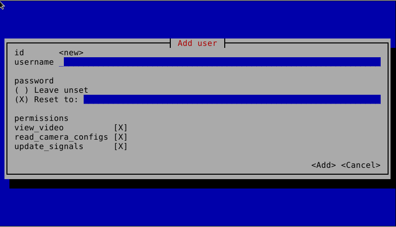

The select Done and Finish 

#### Test set-up

	/usr/local/bin/moonfire-nvr run     --rtsp-library=ffmpeg     --db-dir=/var/lib/moonfire-nvr/db     --http-addr=0.0.0.0:8080 

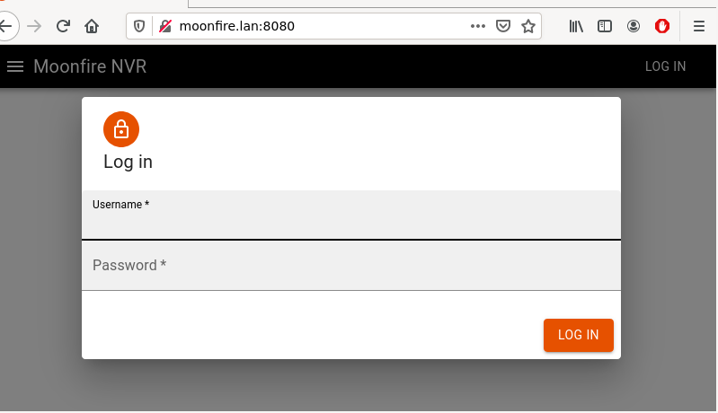
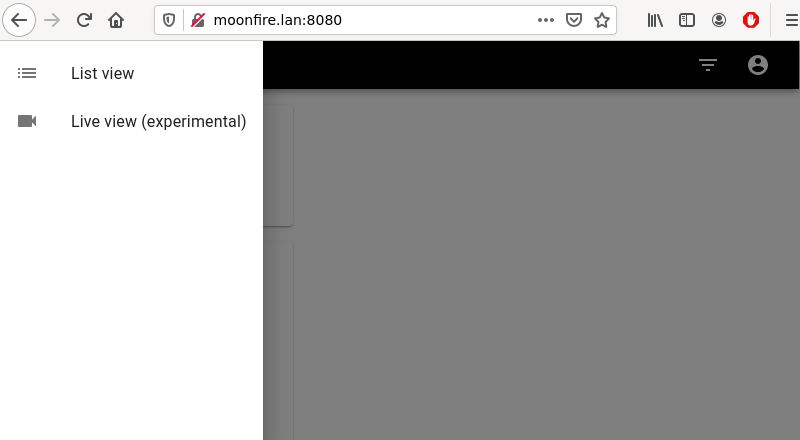

#### Set systemctl

Ctrl-C twice to exit the test above 

	sudo systemctl daemon-reload 
	sudo systemctl enable moonfire-nvr
	sudo systemctl start moonfire-nvr	

### Goodnight view 
Cameras in infra-red mode

